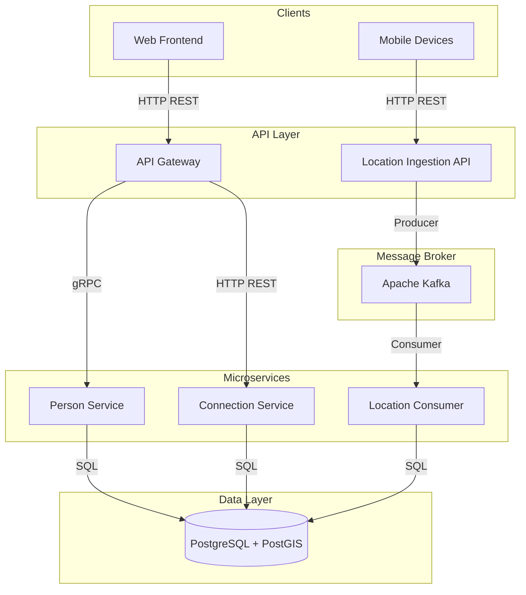

# UdaConnect Architecture Diagram

```mermaid
graph TB
    subgraph "Clients"
        WebFrontend[Web Frontend]
        Mobile[Mobile Devices]
    end

    subgraph "API Layer"
        APIGateway[API Gateway]
        LocationIngestionAPI[Location Ingestion API]
    end

    subgraph "Message Broker"
        Kafka[Apache Kafka]
    end

    subgraph "Microservices"
        PersonService[Person Service]
        ConnectionService[Connection Service]
        LocationConsumer[Location Consumer]
    end

    subgraph "Data Layer"
        DB[(PostgreSQL + PostGIS)]
    end

    %% Request/Response Relationships
    WebFrontend -- "HTTP REST" --> APIGateway
    Mobile -- "HTTP REST" --> LocationIngestionAPI
    
    APIGateway -- "gRPC" --> PersonService
    APIGateway -- "HTTP REST" --> ConnectionService
    
    LocationIngestionAPI -- "Producer" --> Kafka
    Kafka -- "Consumer" --> LocationConsumer
    
    PersonService -- "SQL" --> DB
    ConnectionService -- "SQL" --> DB
    LocationConsumer -- "SQL" --> DB
```
